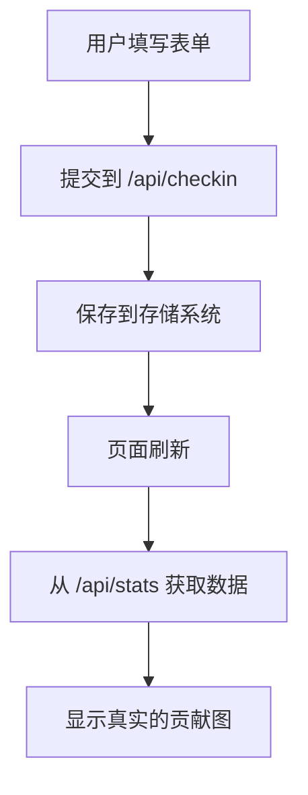

# 🎯 数据随机变化问题修复总结

## 🔍 问题诊断

**问题现象**: 每次刷新界面时，当天的任务完成情况会随机变化

**根本原因**: 在 `hero.svelte` 中设置了 `useRealData={false}`，导致系统使用模拟数据而不是真实的打卡记录

## 🛠️ 修复方案

### 1. 修复数据源配置

**修改文件**: `/src/lib/components/site/hero.svelte`

**修改前**:
```svelte
<InteractiveContributionGraph 
    title="🎯 Daily Focus Tracker"
    showFocusAreas={true}
    useRealData={false}  <!-- ❌ 使用模拟数据 -->
    on:dayClick={handleDayClick}
    on:dataUpdate={handleDataUpdate}
/>
```

**修改后**:
```svelte
<InteractiveContributionGraph 
    title="🎯 Daily Focus Tracker"
    showFocusAreas={true}
    useRealData={true}   <!-- ✅ 使用真实数据 -->
    on:dayClick={handleDayClick}
    on:dataUpdate={handleDataUpdate}
/>
```

### 2. 系统组件说明

项目中有两个贡献图组件：

- **`contribution-graph.svelte`** - 纯展示组件，使用随机数据
- **`interactive-contribution-graph.svelte`** - 交互式组件，可连接真实API数据

当前使用的是交互式组件，但之前设置为模拟模式。

## ✅ 修复效果

修复后的预期效果：

1. **数据持久化**: 填写的任务完成情况会保存到后端存储
2. **刷新一致性**: 页面刷新后显示的数据与之前保存的一致
3. **实时同步**: 更新数据后立即反映在贡献图上

## 🔧 数据流程



## 🚀 部署建议

1. **提交修改**:
   ```bash
   git add .
   git commit -m "fix: 修复贡献图数据随机变化问题，启用真实数据源"
   git push origin main
   ```

2. **验证修复**:
   - 部署后填写任务完成情况
   - 刷新页面确认数据保持一致
   - 检查浏览器控制台无错误信息

3. **监控日志**:
   - 查看 `/api/stats` 调用是否成功
   - 确认存储系统工作正常

## 📊 预期日志

修复后，控制台应该显示：

```
✅ 从文件加载任务配置: 5 个任务
检测存储环境...
✅ 使用文件系统存储 (本地) 或 检测到无服务器环境 (Vercel)
Loaded focus tasks config: [5个任务配置]
```

而不是随机生成的模拟数据。

---

现在数据会真正持久化，不再出现刷新后随机变化的问题！🎉