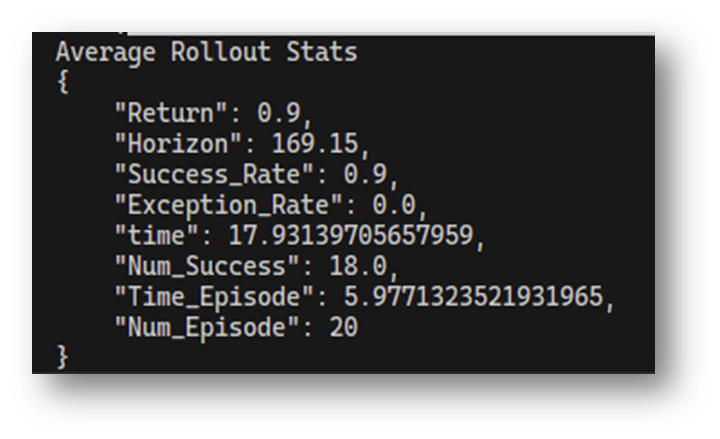

## 2024-11-29, weekly meeting report
### 上周工作计划
  - [X] 采集KuavoToy数据, 训练
  - [X] kuavo manipulation README.md
    
    
    ```Note:two cams order```
    

### 下周计划:
  - [ ] KuavoToy部署
  - [ ] 3D感知数据集(基准坐标系选择, 室内场景下固定相机点云)
  - [ ] 3D算法实现
  - [ ] 读论文


## 2024-11-15, weekly meeting report
### 上周工作计划
  - [X] kuavo 环境配置，
  - [X] kuavo 上测试通信
  - [X] 读论文
  - [X] ppt

### 下周计划:
  - [ ] kuavo采数据
  - [ ] kuavo部署
  - [ ] https://binghao-huang.github.io/3D-ViTac/
        

## 2024-11-08, weekly meeting report
### 上周工作计划
  - [X] 修改diffusion policy, state_vec and low_dim MLP
  - [ ] kuavo 上测试通信
  - [X] 读论文

### 下周计划:
  - [ ] 读论文
  - [ ] kuavo采数据
  - [ ] kuavo部署

### paper reading
[3D Diffuser Actor: Policy Diffusion with 3D Scene Representations](https://3d-diffuser-actor.github.io/)


## 2024-11-01, monthly meeting report
### tools
1. cuda docker  
   1. docker安装：https://mirrors.tuna.tsinghua.edu.cn/help/docker-ce/
   2. nvidia container toolkit安装：https://docs.nvidia.com/datacenter/cloud-native/container-toolkit/latest/install-guide.html
      - issue(no release version):https://github.com/NVIDIA/nvidia-container-toolkit/issues/89, https://blog.csdn.net/lyx_323/article/details/141168405
   3. cuda11.8 ubuntu20.04 cudnn8 docker hub: https://hub.docker.com/r/nvidia/cuda/tags?name=11.8
2. 哈深论文模板
   1. 哈深教务部学生培养：http://due.hitsz.edu.cn/xwgl/ssxwpy/ktyzj.htm
   2. 【通知】关于2023年春季学期硕士研究生学位论文中期检查及答辩工作安排的通知http://due.hitsz.edu.cn/info/1210/4794.htm
   3. e.g.:研究生中期模板：http://due.hitsz.edu.cn/system/_content/download.jsp?urltype=news.DownloadAttachUrl&owner=1481660265&wbfileid=11373754 
3. Zotero
   1. 翻译插件(pdf-translate)：https://zotero-chinese.com/user-guide/plugins/translate, https://blog.csdn.net/Rong_Gong/article/details/124385746
   2. google插件(Zotero Connector)：https://chromewebstore.google.com/detail/zotero-connector/ekhagklcjbdpajgpjgmbionohlpdbjgc?pli=1
   
## 2024-10-25, weekly meeting report
- leetcode daily + 2 top interview 150
- 写dataset loader
- brain practice
- 对于特征提取,如何把提取的特征放入模型训练,low_dim与非low_dim的处理

<!-- ### rdt
#### prev acknowledge
1. diffusion model 

#### points
1. diffsuion expressiveness, transformer scalability
2. To characterize the nonlinear dynamics, high-frequency changes and unstable numerical range inherent in robotic data,
3. Physically Interpretable Unified Action Space,
4. Finally, ablation studies show that diffusion modeling, large model size, and large data size all contribute to superior performance.
5. 包括aloha在内的方法都是task specified， 双手操作没有好办法
6. 直接使用大模型将动作离散的方法精度不行
7. 小模型和基于规则的方法都没有泛化性
8. 使用多种单臂的数据只是为了增强双臂的操作能力而不是给多个机器人用
#### Challenge
##### model
1. powerful architecture ->***RDT**
    - diffsuion **expressiveness**, transformer multimodal inputs **scalability**

2. 异质的机器人数据（heterogeneous data.）->proposing a **physically interpretable unified action space** to unify various robot action spaces
    - `之前要么找个像数据集的robot，要么筛跟robot一样的数据；`
    - 多模态输入：把low_dim, image, language三个obs 模态编码后cat起来作为diffsion model的输入
    - 多种类的机器人数据：做一个大的robot_state,对于特定机器人有就填，没有就pad
##### data
1. 大的robot_state
2. rewrite instruction with GPT4-Turbo -->

### meeting 

- 上周工作计划
  - [ ] 21楼机器部署diffusion policy
  - [ ] 修改diffusion policy代码，在仿真验证效果
  - [X] [RDT](https://github.com/thu-ml/RoboticsDiffusionTransformer?tab=readme-ov-file)

- 本周工作主要内容(详细介绍)
  - **train config**:  
    16batch, 200epoch, 4min/epoch, 150epochs/10h, 1500epochs/100h  
  - **dataset config**:   
    img_size(256,256,3), 2obs->16actions, 14000steps, 80episodes, 10hz, 
  - 

- suffer:
  1. 显卡不行 -> 租卡
  2. 采集的数据不是严格的30hz，帧差0.032-0.036不等 -> 先测试看效果, SongLing大白的相机

- 下周工作计划
  - 继续21楼机器部署
  - 看RDT代码


## 2024-10-18, weekly meeting report
- 上周工作计划
  - [X] 仿真平台验证diffusion policy

- 本周工作主要内容(详细介绍)
  - 在公开的数据集上验证200个episode训练的diffusion policy，成功率有90%

- 下周工作计划安排
  - 21楼机器部署diffusion policy
  - 修改diffusion policy代码，在仿真验证效果
  - [RDT](https://github.com/thu-ml/RoboticsDiffusionTransformer?tab=readme-ov-file)


## 2024-10-16, with scir team


## 2024-10-11, weekly meeting report
- 上周工作计划
  - [ ] 实机docker部署diffusion policy -> 深圳没空余机器
  - [X] 仿真平台搭建和代码部署

- 本周工作主要内容(详细介绍)
  - docker部署diffusion policy, 
  - 使用离线数据集验证4080训练diffusion 10h的结果，至少离线(仿真)比octo的好
  - 仿真平台(IL sim : robomimic, mimicgen(JD), robosuite)
    
  
- 遇到的问题及解决方法
  - 没有机器人 -> 仿真环境

- 下周工作计划安排
  - 将diffusion policy部署到仿真环境中

- meeting rec
  - 每周两篇论文，ppt分享一篇，每周来3天
  - 减少数据集试试diffusion policy
  - 看看论文为什么transformer+diffusion并不好，而纯diffusion policy好 
  - 使用力的导 -> 作为条件
  - 预处理图片使用语义condition的背景去噪


```markdown
1. 周例会内容要点格式(文档形式)
- 上周工作计划
- 本周工作完成情况
- 本周工作主要内容(详细介绍)
- 遇到的问题及解决方法
- 下周工作计划安排


2. 月例会内容要点格式(PPT汇报形式)
- 上月工作计划
- 本月工作完成情况
- 本月工作主要内容(详细介绍)
- 遇到的问题及解决方法
- 下月工作计划安排

1.例会以研发计划表作为驱动，根据实际情况调整方案与内容；
2.为方便实验室数据、文件、视频等大容量存档需求，实验室会搭建NAS服务器，周报、月报、课题室电子文件等统一用NAS进行存档，方便大家存档与调用；
3.代码的开发与存档统一用公司的私有git服务器lejuhub进行管理，方便与公司研发进行代码对接。
```

## 2024-09-22, weekly meeting report
- 上周工作计划
  - [X] 阅读diffusion代码, 在老数据集跑通训练。
  - [X] 添加fake_touch模态(low_dim), 训练。
  - [ ] 3d diffusion论文，代码。
- 本周工作主要内容(详细介绍)
  - rosbag->zarr数据集转换代码
  - 修改diffusion代码，添加fake_touch维度 
  
- 遇到的问题及解决方法
  - 暂时没大问题，主要是一些环境配置问题，已解决。
  - 没有机器人 -> 学习仿真环境
  
- 下周工作计划安排
  - 将diffusion policy部署demo，测试通信
    - docker + ros
  - 研究深度和触觉的编码设计
    - RGBD or Pointcloud 
    - touch : low dim or encoder 
  - 3d diffusion论文，代码

## 2024-09-27， monthly meeting report
框架技术路线，ppt
- 上月工作计划
  - [X] 阅读diffusion代码, 在老数据集跑通训练。
  - [X] 添加fake_touch模态(low_dim), 跑通训练。
  - [X] diffusion部署
  - [ ] diffusion测试
  - [ ] 3d diffusion论文，代码
- 本月工作主要内容(详细介绍)
  - 数据集格式转换
  - 修改diffusion代码，添加fake_touch维度
  - 编写部署的代码，docker打包
  <!-- - 使用离线数据集验证4080训练diffusion 10h的结果，至少离线(仿真)比octo的好 -->
  
- 遇到的问题及解决方法
  - docker占用空间->'docker run --rm' or 'docker system prune'
  - 
- 下月工作计划安排
  - 解决部署过程中的问题并优化部署代码
  - 3d diffusion论文，代码

- meeting rec
  - 对标什么改进


